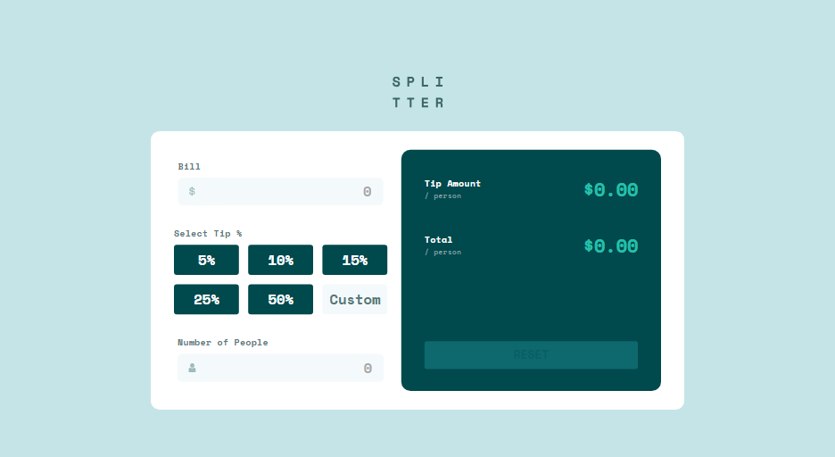

# Frontend Mentor - Tip calculator app solution

This is a solution to the [Tip calculator app challenge on Frontend Mentor](https://www.frontendmentor.io/challenges/tip-calculator-app-ugJNGbJUX). Frontend Mentor challenges help you improve your coding skills by building realistic projects.

## Table of contents

- [Overview](#overview)
  - [The challenge](#the-challenge)
  - [Screenshot](#screenshot)
  - [Links](#links)
- [My process](#my-process)
  - [Built with](#built-with)
  - [What I learned](#what-i-learned)
  - [Continued development](#continued-development)
  - [Useful resources](#useful-resources)
- [Author](#author)

## Overview

### The challenge

Users should be able to:

- View the optimal layout for the app depending on their device's screen size
- See hover states for all interactive elements on the page
- Calculate the correct tip and total cost of the bill per person

### Screenshot



### Links

- Solution URL: [GitHub](https://github.com/artemkotko14/tip-calculator-app)
- Live Site URL: [Webpage](https://artemkotko14.github.io/tip-calculator-app/)

## My process

### Built with

- Semantic HTML5 markup
- SASS
- Flexbox
- CSS Grid
- Mobile-first workflow
- JavaScript

### What I learned

I learned how to enhance keyboard accessibility by allowing users to interact with the calculator using the keyboard, especially the Enter key.For example, the following code listens for the Enter key and triggers appropriate actions like selecting a tip or performing the calculation:

```js
document.addEventListener("keydown", (e) => {
  if (e.key === "Enter") {
    e.preventDefault();
    const activeElement = document.activeElement;
    if ([...tipButtons].includes(activeElement)) {
      activeElement.click();
    }
    const validatedInputs = getValidatedInputs();
    if (validatedInputs) {
      reset();
    }
  }
});
```

I learned how to use data attributes to track input validation states directly in the HTML, making it easier to manage and check validity without extra variables. For example, I used data-valid="true" on inputs to indicate if they passed validation:

```js
inputField.dataset.valid = isValid ? "true" : "false";
```

Universal solution for removing arrows in the input:

```css
input[type="number"]::-webkit-outer-spin-button,
input[type="number"]::-webkit-inner-spin-button {
  -webkit-appearance: none;
}

input[type="number"],
input[type="number"]:hover,
input[type="number"]:focus {
  appearance: none;
  -moz-appearance: textfield;
}
```

### Continued development

I future projects I would like to focus on reduce repetition in event handlers (Code reuse) and keep refining user input checks and feedback(Form validation).

### Useful resources

- (https://validator.w3.org/) - Markup Validation Service.

## Author

- Github - [Artem Kotko](https://github.com/artemkotko14)
- Frontend Mentor - [@artemkotko14](https://www.frontendmentor.io/profile/artemkotko14)
